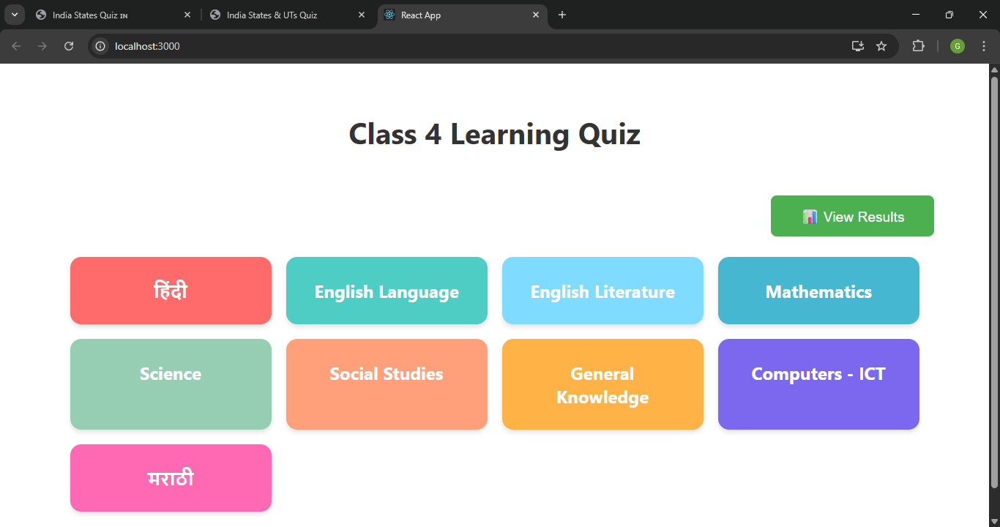
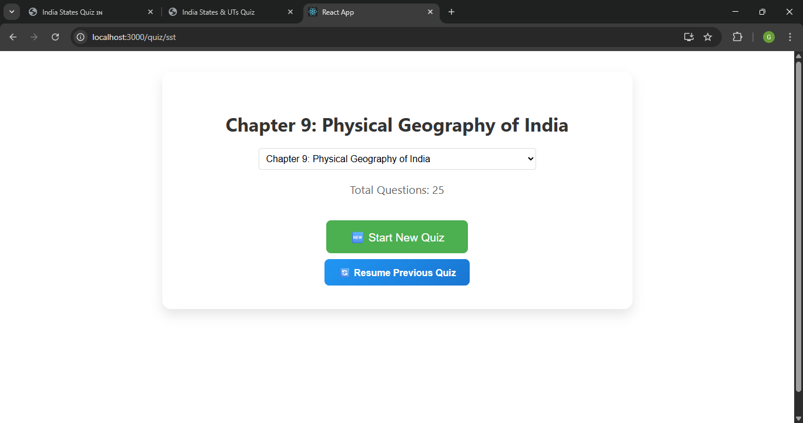
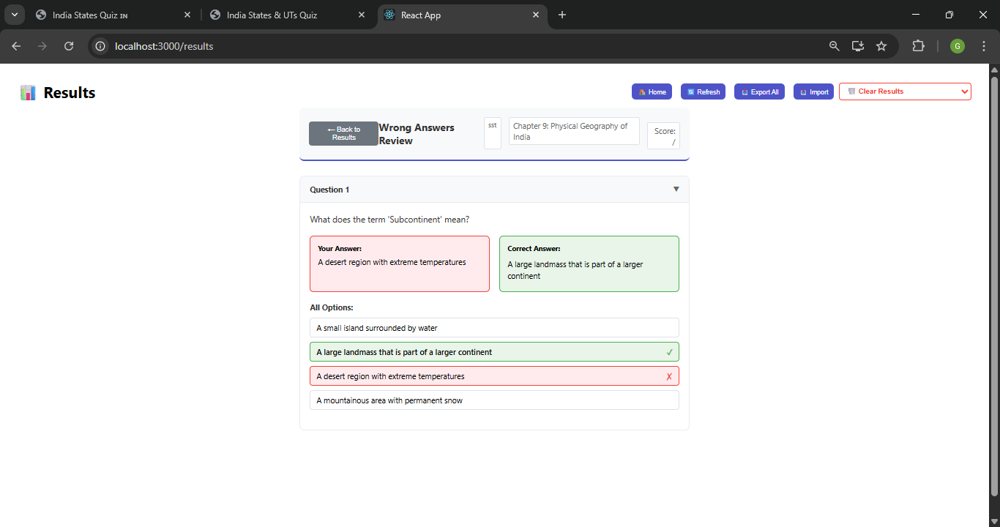
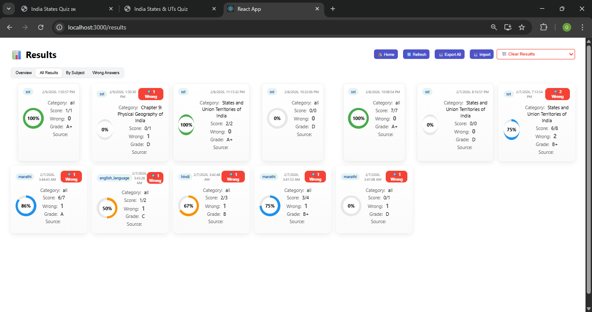

# 🎯 Class 4 Quiz Application - Complete Setup Guide

## 📚 Table of Contents
- [Overview](#overview)
- [Features](#features)
- [Installation](#installation)
- [Running the Application](#running-the-application)
- [User Interface Guide](#user-interface-guide)
- [Storage & Data Management](#storage--data-management)
- [Troubleshooting](#troubleshooting)

---

## 🎮 Overview

The Class 4 Quiz Application is a comprehensive educational platform designed for 4th-grade students. It features interactive quizzes across multiple subjects with permanent serverless storage, wrong answers review, and detailed performance tracking.

### 🌟 Key Features
- **📚 Multiple Subjects**: Hindi, English, Math, Science, SST, GK, ICT, Marathi
- **🗄️ Permanent Storage**: IndexedDB-based storage that survives browser restarts
- **📥 Export/Import**: Backup and restore quiz results
- **🔍 Wrong Answers Review**: Detailed review of mistakes with explanations
- **📊 Performance Analytics**: Track progress and improvement over time
- **🎨 Beautiful UI**: Modern, responsive design with animations
- **📱 Mobile-Friendly**: Works perfectly on tablets and phones

---

## 🛠️ Installation

### Prerequisites
- **Node.js** (version 14 or higher)
- **npm** (comes with Node.js)

### Step-by-Step Installation

1. **Download/Clone the Project**
   ```bash
   git clone https://github.com/coregopal/classs4.git
   cd classs4
   ```

2. **Install Dependencies**
   ```bash
   npm install
   ```

3. **Verify Installation**
   - Ensure you have `node_modules` folder
   - Check `package.json` exists

---

## 🚀 Running the Application

### Method 1: Using run.bat (Recommended for Windows)

1. **Double-click `run.bat`**
2. **Wait for the setup to complete**
3. **Application will open automatically** in your browser

### Method 2: Using npm Commands

1. **Open Terminal/Command Prompt**
2. **Navigate to project directory**
   ```bash
   cd path/to/classs4
   ```
3. **Start the application**
   ```bash
   npm start
   ```

### What You'll See

```
Starting Grade 4 Learning Quiz Application...

🚀 Serverless File Storage Enabled!
📁 Results will be stored permanently in browser storage
💾 Use Export/Import buttons for backup

Starting React app on port 3000...

Compiled successfully!

You can now view class4-quiz-app in the browser.
  Local:            http://localhost:3000
  On Your Network:  http://192.168.1.7:3000
```

---

## 🎨 User Interface Guide

### 1. Home Screen


**Features:**
- **Subject Selection**: 9 subjects with colorful cards
- **View Results Button**: Access historical quiz results
- **Responsive Design**: Works on all screen sizes

**How to Use:**
1. Click on any subject card to start a quiz
2. Click "📊 View Results" to see past performance

### 2. Quiz Start Screen


**Features:**
- **Category Selection**: Choose specific topics or "All Categories"
- **Question Count**: Shows total questions available
- **Resume Option**: Continue from where you left off (if available)

**How to Use:**
1. Select category from dropdown
2. Click "🆕 Start New Quiz" or "🔄 Resume Previous Quiz"

### 3. Quiz Interface


**Features:**
- **Question Display**: Clear, readable questions
- **Multiple Choice**: Click to select answers
- **Timer**: 30 seconds per question
- **Progress Bar**: Visual progress indicator
- **Navigation**: Previous/Next buttons

**How to Use:**
1. Read the question carefully
2. Click on your answer choice
3. Wait for feedback (correct/incorrect)
4. Click "Next Question" or wait for auto-advance

### 4. Quiz Results


**Features:**
- **Grade Display**: Visual grade with emoji and color
- **Detailed Statistics**: Score, accuracy, attempts
- **Performance Feedback**: Personalized encouragement
- **Wrong Answers Review**: Review mistakes with explanations
- **Action Buttons**: Home, Try Again, Save Result

**How to Use:**
1. Review your performance metrics
2. Click "🔍 Review Wrong Answers" if available
3. Choose next action (home, retry, etc.)

### 5. Wrong Answers Review


**Features:**
- **Question Details**: Full question text
- **Answer Comparison**: Your answer vs correct answer
- **Explanations**: Detailed explanations for learning
- **All Options**: Complete list of answer choices
- **Expandable Questions**: Click to expand/collapse details

**How to Use:**
1. Click on any question to expand details
2. Compare your answer with correct answers
3. Read explanations to understand concepts
4. Use "🔙 Back to Results" when done

### 6. Historical Results


**Features:**
- **Overview Tab**: Summary statistics and best subjects
- **All Results Tab**: Complete history with filtering
- **Subject Tabs**: Filter by specific subjects
- **Wrong Answers Tab**: Focus on areas needing improvement
- **Export/Import**: Backup and restore functionality
- **Clear Results**: Selective data management

**How to Use:**
1. Navigate between tabs for different views
2. Click on result cards to see details
3. Use export/import for data backup
4. Clear old results when needed

---

## 💾 Storage & Data Management

### 🗄️ Serverless Storage System

**Technology Used:**
- **IndexedDB**: Browser-native permanent storage
- **File System Access API**: Direct file operations (Chrome/Edge)
- **JSON Export/Import**: Universal data format

**Storage Features:**
- **Permanent**: Data survives browser restarts
- **Large Capacity**: Can store gigabytes of data
- **Fast Performance**: Instant access, no network delays
- **Privacy-First**: Data never leaves your device

### 📥 Export/Import Functionality

**Export Data:**
1. Go to Results page
2. Click "📥 Export All" button
3. Save JSON file to your computer
4. File format: `quiz-results-all-YYYY-MM-DD.json`

**Import Data:**
1. Go to Results page
2. Click "📤 Import" button
3. Select JSON file from your computer
4. Data merges with existing results

**File Format Example:**
```json
[
  {
    "subject": "math",
    "category": "all",
    "totalQuestions": 50,
    "attemptedQuestions": 45,
    "correctAnswers": 38,
    "percentage": 84,
    "grade": "A",
    "wrongAnswers": [...],
    "timestamp": "2025-02-04T10:30:00.000Z",
    "date": "2025-02-04"
  }
]
```

### 🗑️ Data Management

**Clear Results:**
- **Clear All**: Remove all quiz results
- **Clear by Subject**: Remove results for specific subjects
- **Confirmation Dialog**: Prevents accidental deletion

**Storage Statistics:**
- Total results count
- Subject-wise distribution
- Date range of stored data
- Storage space usage

---

## 🔧 Troubleshooting

### Common Issues & Solutions

#### 1. Application Won't Start
**Problem**: Nothing happens when running `run.bat` or `npm start`

**Solutions**:
- Check Node.js installation: `node --version`
- Check npm installation: `npm --version`
- Verify you're in the correct directory
- Try deleting `node_modules` and running `npm install` again

#### 2. Port Already in Use
**Problem**: "Something is already running on port 3000"

**Solutions**:
- Let React choose another port automatically (press 'y')
- Or kill the existing process:
  ```bash
  netstat -ano | findstr :3000
  taskkill /PID [PROCESS_ID] /F
  ```

#### 3. Compilation Errors
**Problem**: ESLint or compilation errors

**Solutions**:
- Check error messages in terminal
- Ensure all imports are correct
- Verify all dependencies are installed
- Run `npm install` to update dependencies

#### 4. Results Not Saving
**Problem**: Quiz results not appearing in Results page

**Solutions**:
- Check browser console for errors
- Ensure IndexedDB is enabled in browser
- Try refreshing the page
- Clear browser cache and try again

#### 5. Export/Import Not Working
**Problem**: Can't export or import data

**Solutions**:
- Check browser permissions for file downloads
- Ensure JSON file format is correct
- Try using Chrome/Edge for full File System Access API support
- Check file size limits

### Browser Compatibility

| Browser | Full Support | Limited Support | Notes |
|---------|--------------|----------------|-------|
| Chrome | ✅ | | Full File System Access API |
| Edge | ✅ | | Full File System Access API |
| Firefox | ✅ | | Download/Upload only |
| Safari | ✅ | | Download/Upload only |
| Mobile Chrome | ✅ | | Touch-optimized |
| Mobile Safari | ✅ | | Touch-optimized |

### Performance Tips

1. **Regular Backups**: Export results regularly
2. **Clear Old Data**: Remove old results periodically
3. **Browser Update**: Keep browser updated for best performance
4. **Storage Space**: Monitor IndexedDB usage in browser settings

---

## 📞 Support

For additional help:
1. Check this README first
2. Review browser console for error messages
3. Ensure all prerequisites are met
4. Test with different browsers if needed

---

## 🎉 Enjoy Learning!

The Class 4 Quiz Application is designed to make learning fun and effective. With permanent storage, detailed analytics, and comprehensive review features, students can track their progress and improve their knowledge across all subjects.

**Happy Learning! 🎓📚**
