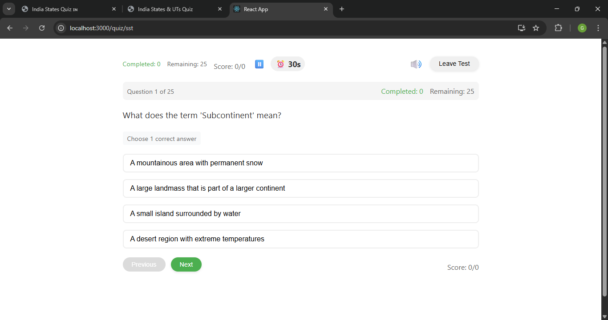
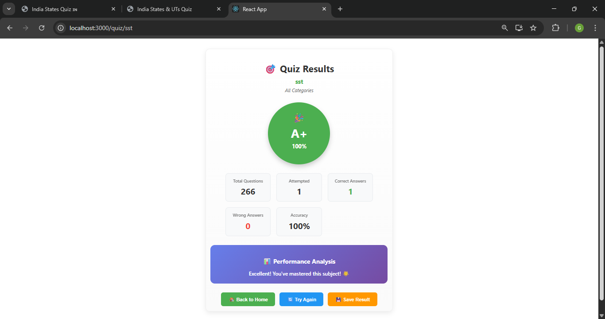

# Class 4 Quiz Application

A comprehensive educational quiz application designed for Class 4 students, featuring interactive quizzes across multiple subjects with PDF resources and audio feedback.

## 📚 Overview

This React-based quiz application provides an engaging learning experience for Class 4 students with:
- **Interactive quizzes** across 8 different subjects
- **PDF resources** for each subject chapter
- **Audio feedback** for correct/incorrect answers
- **Progress tracking** and score management
- **Responsive design** for various screen sizes

## 🖼️ Application Screenshots

### Home Page

*Main dashboard showing all available subjects*

### Quiz Interface

*Interactive quiz with multiple choice questions and timer*

### Subject Selection

*Different subjects available for quiz*

### Quiz Results

*Score display and performance summary*

### PDF Resources

*Access to study materials and PDF resources*

### Mobile Responsive View

*Responsive design working on mobile devices*

## 🎯 Subjects Covered

The application includes quizzes for the following subjects:

1. **English Language** - Grammar and language skills
2. **English Literature** - Reading comprehension and literary analysis
3. **Hindi** - Hindi language and literature
4. **Marathi** - Marathi language and literature
5. **Mathematics** - Mathematical concepts and problem-solving
6. **Science** - Scientific concepts and experiments
7. **Social Studies (SST)** - History, geography, and civics
8. **ICT** - Information and Communication Technology
9. **General Knowledge (GK)** - General awareness and current affairs

## 📖 PDF Resources

Each subject includes comprehensive PDF resources:
- **Ankur** - Hindi literature and language
- **Friday Afternoon** - English literature
- **Grammar** - English grammar rules
- **Mulberry** - English literature and poetry
- **New Find Out** - General knowledge and discovery
- **Science** - Scientific concepts and experiments
- **SST** - Social studies chapters and themes

## 🚀 Features

- **Multiple Choice Questions** - Interactive quiz format
- **Audio Feedback** - Sound effects for correct/wrong answers
- **Score Tracking** - Real-time score calculation
- **Subject Selection** - Choose from different subjects
- **Responsive Design** - Works on desktop, tablet, and mobile
- **PDF Integration** - Access to study materials
- **Progress Indicators** - Visual feedback on quiz progress

## 🛠️ Technology Stack

- **Frontend**: React.js
- **Styling**: CSS3
- **Audio**: HTML5 Audio API
- **PDF Viewer**: Browser-native PDF support
- **Routing**: React Router DOM
- **Build Tool**: Create React App

## 📦 Installation

1. **Clone the repository**
   ```bash
   git clone https://github.com/coregopal/classs4.git
   cd classs4
   ```

2. **Install dependencies**
   ```bash
   npm install
   ```

## 🏃‍♂️ Running the Application

### Development Mode
```bash
npm start
```
- Opens the app at [http://localhost:3000](http://localhost:3000)
- Hot reload enabled for development
- Shows lint errors in console

### Production Build
```bash
npm run build
```
- Creates optimized production build in `build` folder
- Minified and optimized for deployment

### Running Tests
```bash
npm test
```
- Launches test runner in interactive mode
- Runs all test suites

### Alternative: Using the Batch File (Windows)
```bash
run.bat
```
- Automatically installs dependencies and starts the development server
- Convenient for Windows users

## 📁 Project Structure

```
classs4/
├── public/
│   ├── pdf/           # Subject PDF resources
│   ├── sounds/        # Audio feedback files
│   └── index.html     # Main HTML file
├── src/
│   ├── components/    # React components
│   ├── data/          # Quiz data (JSON files)
│   ├── styles/        # CSS stylesheets
│   └── App.js         # Main application component
├── package.json       # Dependencies and scripts
└── README.md          # This file
```

## 🎮 How to Use

1. **Select a Subject** - Choose from the available subjects on the home page
2. **Start Quiz** - Click on any subject to begin the quiz
3. **Answer Questions** - Select the correct answer from multiple choices
4. **Get Feedback** - Audio feedback for correct/incorrect answers
5. **View Results** - See your final score and performance
6. **Access PDFs** - Review study materials in the PDF section

## 📊 Quiz Features

- **Randomized Questions** - Questions appear in random order
- **Multiple Choice** - 2-4 options per question
- **Immediate Feedback** - Instant audio and visual feedback
- **Score Calculation** - Real-time score tracking
- **Progress Bar** - Visual progress indicator

## 🔧 Customization

### Adding New Questions
Edit the JSON files in `src/data/` to add new questions:
```json
{
  "category": "Subject Name",
  "question": "Your question here?",
  "options": ["Option 1", "Option 2", "Option 3", "Option 4"],
  "correct_answer": "Correct Option",
  "explanation": "Explanation for the answer"
}
```

### Adding New Subjects
1. Create a new JSON file in `src/data/`
2. Add the subject to the subject list in the application
3. Include corresponding PDF resources in `public/pdf/`

## 🌐 Deployment

The application can be deployed to various platforms:

### Netlify
```bash
npm run build
# Upload build folder to Netlify
```

### Vercel
```bash
npm run build
# Deploy using Vercel CLI
```

### GitHub Pages
```bash
npm run build
# Deploy build folder to GitHub Pages
```

## 🤝 Contributing

1. Fork the repository
2. Create a feature branch (`git checkout -b feature/AmazingFeature`)
3. Commit your changes (`git commit -m 'Add some AmazingFeature'`)
4. Push to the branch (`git push origin feature/AmazingFeature`)
5. Open a Pull Request

## 📝 License

This project is licensed under the MIT License - see the LICENSE file for details.

## 👨‍💻 Author

**Core Gopal**
- GitHub: [@coregopal](https://github.com/coregopal)

## 🙏 Acknowledgments

- React.js community for the excellent framework
- Create React App for the development setup
- All contributors and testers

---

**Happy Learning! 📚✨**
